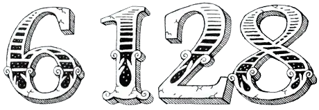
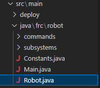
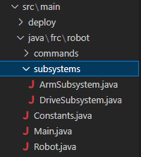
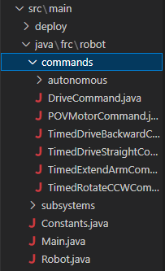
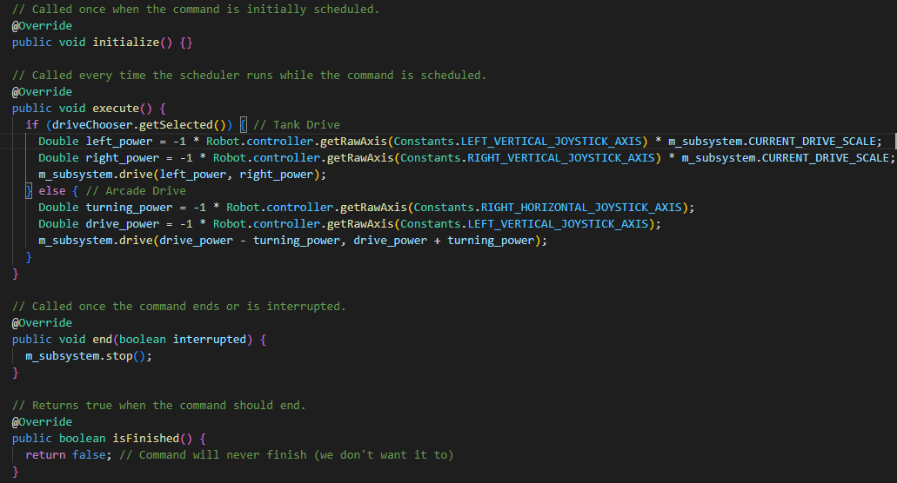

# Oceana FRC Team 6128
This code uses a `tank drivetrain` (left joystick controls left side, and the right joystick controls right side). The drivetrain uses two SparkMax motor controllers, one for the left side wheels, one for the right side wheels. The driver uses an xbox controller to sends signals to the SparkMax motor controller through a computer, and across the Control Area Network (CAN) "bus". A simple autonomous mode is also included. This project demonstrates the command-based programming paradigm (directory/folder structure).

{:target="_blank"}

# Definitions

## Command-based programming
Command-based programming is a paradigm (or a pattern) that is used for programming a robot. It involves the use of *commands* an *subsystems* to control a robot. In general, **commands** are used to control the robot's subsystems. **Subsystems** are used to describe the nature of the robot and its specialties.  

## Subsystems
The Subsystems directory (folder) contains individual java files that define the collections of motors and sensors that form from a natural grouping of the robot (e.g., DriveSubsystem.java (wheels, motors, and motor controllers), GrabberSubsystem.java (pneumatic piston and pressure sensors), VisionSubsystem.java (camera pipelines), ExtenderSubsystem.java (arm that extends or retracts), LEDSubsystem.java (for style points or lighting up Apriltag reflectors), etc. Each subsystem typically has its own .java file.These subsystems are the "robots super-powers." When one subsystem is being used, it will not interfere with the use of other subsystems. Commands interact with these subsystems! NOTE: If two separate commands control the same part of a subsystem (like a motor), then these two commands *cannot* happen at the same time! Command scheduler to the rescue! See [IRL Example 1](#irl-example-1) and [IRL Example 2](#irl-example-2) for better understanding.  
  

## Commands
The Commands directory (folder) act on the public/default methods of the subsystems to achieve a specific robot movement. Each command has its own .java file. For example; there could be a  (e.g., DriveCommand.java; ExtendArmCommand.java; BalanceOnChargeStationCommmand.java), DriveInFrontOfAprilTagCommand.java, etc... Learn more about command-based programming [here](https://docs.wpilib.org/en/stable/docs/software/commandbased/index.html). Make it easy on yourself, read the docs for more info on [command-structure](https://docs.wpilib.org/en/stable/docs/software/commandbased/commands.html).  
  

## Methods
Methods are functions that are used to either perform or override other functions. Commands and Subsystems have default Java methods that we are expected to override and create our own code. Each default Java command has the following methods:
- initialize() {}, runs once
- execute() {}, on-going operation command
- end() {}, defines what happen when command ends
- isFinished() {}, termination command (could be used to set a return "flag" that leaves the command if return = true; or continue to execute if return = false;)  
  

## Rubber ducky says, `"coding is fun"`

## Past Robot and This Code Features:
1. **Drivetrain:** This drivetrain uses two brushed CIM motors in a Tank Drive configuration by default. The driver can set Arcade Drive using the SmartDashboard 2023 (or shuffleboard) to see which configuration they like better. They can also set the speed. Last year we used an Arcade Drive. With more effort, we could use encoders to drive for a specific amount of distance, gyroscopes to turn to a specified angle or to balance with the help of sensors. What's more? With the help of vision, we could have programmed the drivetrain to automatically aim at the Apriltags and then drive in front of the Apriltags to score!
2. **Grabber:** Last year we could pick up both cubes and cones with our "grabber subsystem," which was controlled by a single pneumatic piston! This subsystem was simple and effective. It used the REV Pneumatic Hub module to send and receieve control signals. This program does not have pneumatic integration yet.
3. **Vision:** We missed this last year! One of the coolest software features in FRC is to be able to demonstrate Apriltag tracking! It is possible to run a PhotonVision pipeline on a Raspberry Pi 3 B+ to detect Apriltags. Wwe can track and follow either the nearest apriltag or an apriltag with a specified ID. With more work, there could be a separate vision pipeline that tracks objects, which could tell the robot what the object is, how far away it is, and then command the drivetrain to travel there and interact with it!
4. **Extender:** Our "Extender" subsystem was an "upcycling" of the climber-in-a-box from past FRC activites. This feature extended our arm to grab and score! This extender subsystem was driven by a single snowblower motor and was quite slow to extend and retract. It was controlled manually by our Drive Team using joystick axes. With some more know-how, we could make preset button command to autonomously move to set positions using an encoder device. This code includes the extension option with a NEO brushless motor using POV buttons.
5. **LED Subsystem:** This year, maybe we can add an LEDSubsystem for style points! This could use the PWM outputs on our RoboRIO to make fun patterns.

How to get set up for FRC programming on your PC:
1) Install the 2023 release of WPILib [here](https://github.com/wpilibsuite/allwpilib/releases)
2) Install the 2023 NI FRC Game Tools [here](https://www.ni.com/en-us/support/downloads/drivers/download.frc-game-tools.html#473762)

This project was created using the **"Timed Robot"** template/style with our code being written in *Java*.

# IRL Example 1
Command-based computer pattern: Your keyboard is a subsystem that lets you use a computer (**KeyboardSubsystem.java**). Your monitor is a separate subsystem (**MonitorSubsystem.java**). Your mouse is also considered a subsystem (**MouseSubsystem.java**). Clicking a mouse button is a command; left clicking is a method, and right clicking is a different method. Both of these methods use the same mouse click command. You CANNOT left-click and right-click at the same time. The click command must use either the left-click method, or the right-click method first. The "**command scheduler**" can handle that. If your mouse and keyboard subsystems are connected to your monitor subsystem (in Java this is done by `import frc.robot.subsystems.KeyboardSubsystem;` at the top of the file), then your monitor subsystem can be commanded to display what comes from the keyboard and mouse subsystems. Your keyboard subsystem takes the command of whatever you type, using whatever method you choose. There are different methods of what could be typed: letter/number/character methods, and there are also action-key methods like delete, tab or enter. Your default monitor subsystem (what is currently displayed on the screen) is overridden by the commands that come from the different methods you use on your keyboard subsystem and mouse subsystems. Note: the import lists your filepath, frc/robot/subsystems/KeyboardSubsystem. This is case-sensitive, and the .java file extension is implied. More applicable file structure for this example would be: import java.computer.pc.subsystems.KeyboardSubsystem (where **java, computer, pc, and subsystems are actaul folders that exist and there is a KeyboardSubsystem.java file inside of the subsystems folder** at: java/computer/pc/subsystems/KeyboardSubsystem.java)

# IRL Example 2
Command-based morning pattern: I am using my *default* dream **command** which is part of my sleep **subsystem**. My alarm clock on my phone is an *overridding* **command** that  inturrupts my dream command and wakes me up using Rick Astely's "Never Gonna Give You Up" **method**. I am then commanded out of bed by the smell of cinnamon rolls method. I *end* my sleep command with rolling out of bed. After I roll out of bed, my sleep command *isFinished*. I enter my shower subsystem. I am commanded to use shampoo to wash my hair. Then I am commanded to rinse my hair. I cannot use the conditioner and the shampoo command at the same time because these two separate commands (shampoo command and conditioner command) both require the use of my "arms subsystem" at the same time. One command method must occur before the other. I could make a WashHairCommand.java program that says to use my "arms subsystem" with a "shampoo method" followed by a "rinse method." Then using that same WashHairCommand.java program, i could use the conditioner method before i am finished with the WashHairCommand. I cannot towel off before i take a shower, because the **"command scheduler"** says I have to take the shower before I can use the towel.
